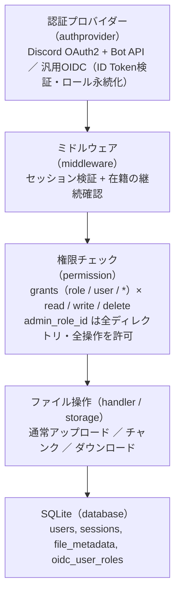

# Discord File Server (fileGo)

[](https://github.com/leCielEtoile/fileGo/actions/workflows/ci.yml)
[](https://github.com/leCielEtoile/fileGo/actions/workflows/release.yml)
[](https://goreportcard.com/report/github.com/leCielEtoile/fileGo)
[](https://opensource.org/licenses/BSD-3-Clause)

Discordの特定サーバー（ギルド）への参加を前提に、ロールやメンバー単位でディレクトリごとのアクセス権限を管理できるファイル共有サーバーです。汎用OIDC（Keycloak / Google等）にも限定的に対応します。

## 特徴

- 🔐 **Discord OAuth2認証** - ギルドメンバーのみログイン可能。ログイン後も在籍を継続確認（5分キャッシュ）
- 🌐 **汎用OIDC対応（補助）** - Keycloak等のOIDCでもログイン可能。メールドメイン/アドレスのallowlistでアクセスを制限
- 👥 **grantsによる権限管理** - ロール単位・メンバー個人単位で、ディレクトリごとに `read` / `write` / `delete` を個別付与
- 📤 **通常アップロード** - 最大100MB（既定）
- 📦 **チャンクアップロード** - 最大500GB（既定）の大容量ファイル、レジューム対応
- 🎬 **Range Request対応** - 動画ストリーミング・部分ダウンロード
- ⚡ **ロールのリアルタイム同期** - Discordゲートウェイでロール変更を即時に認可へ反映（未対応環境はREST方式へ自動フォールバック）
- 🔒 **セキュアな設計** - パストラバーサル対策、セッション管理、構造化ログ（`request_id` 付きJSON）

## 認証プロバイダーは1つに限定

本プロジェクトはDiscordでの利用を主眼としており、**認証プロバイダーは1つだけ**設定できます（複数プロバイダーがそれぞれ別ユーザーを作る複雑さを避けるため）。`config.yaml` の `auth.provider.type` に `discord` または `oidc` を指定します。

| 項目 | Discord (`type: discord`) | 汎用OIDC (`type: oidc`) |
|------|---------------------------|--------------------------|
| ログイン対象 | 指定ギルドのメンバー | 認証できた全ユーザー（allowlistで制限可） |
| ロール取得 | Botトークンで随時取得 | ログイン時のID Tokenの `groups_claim` |
| 在籍の継続確認 | あり（Botトークン、5分キャッシュ） | なし（allowlistで代替） |
| ユーザーディレクトリ | ログイン時に事前作成 | 初回アップロード時に作成 |

> ⚠️ **認証情報は環境変数では設定できません。** `bot_token` / `client_secret` 等の認証設定は `config.yaml` の `auth.provider` でのみ管理します（環境変数で上書きできるのは `server` / `database` / `storage` の一部のみ）。

## クイックスタート

### 前提条件

- Docker & Docker Compose
- Discordの場合: Discordアカウント、対象サーバーの管理者権限、Bot（`SERVER MEMBERS INTENT` 有効）

### Discord Application設定（概要）

1. [Discord Developer Portal](https://discord.com/developers/applications) でアプリケーション作成
2. **OAuth2**: Client ID / Client Secret / Redirect URL (`https://yourdomain.com/auth/callback`) を設定。スコープは `identify` `email` `guilds.members.read`
3. **Bot**: Bot Tokenを取得し `SERVER MEMBERS INTENT` を有効化。生成URLでBotをサーバーへ招待
4. **Guild ID / Role ID**: 開発者モードを有効化してサーバーID・ロールIDをコピー

詳細は [セットアップガイド](docs/SETUP.md) を参照。

### デプロイ

```bash
# 1. 必要なファイルをダウンロード
mkdir fileGo && cd fileGo
curl -O https://raw.githubusercontent.com/leCielEtoile/fileGo/main/docker-compose.yml

# 2. データ用ディレクトリを作り、実行UID/GIDを記録する
#    先に作らないと Docker が root 所有で作成し、非rootコンテナが書き込めない
mkdir -p config data
printf 'PUID=%s\nPGID=%s\n' "$(id -u)" "$(id -g)" > .env

# 3. 初回起動（config.yaml のひな型が自動生成される）
docker compose up -d

# 4. 生成された config.yaml に認証情報を記入して再起動
vi config/config.yaml   # auth.provider に bot_token / client_id / guild_id 等を設定
docker compose restart

# 5. ヘルスチェック
curl http://localhost:8080/health   # => OK
```

手順2で `.env` を自動生成するため、**編集は不要**です。生成されるファイルの所有者があなた自身になり、`sudo` なしで管理・削除できます。

**認証情報（bot_token / client_secret 等）は `config.yaml` に記述**してください（`config.yaml` は `.gitignore` 済み。Docker secrets を使う方法は [デプロイガイド](docs/DEPLOYMENT.md#秘密情報はファイルで渡すfile-規約) を参照）。ポート等を変えたい場合は [.env.example](.env.example) を参考に `.env` へ追記します。

> 💡 **Dockerを使わない場合**: [リリースページ](https://github.com/leCielEtoile/fileGo/releases) の各OS向けバイナリで起動できます（Webアセットは埋め込み済みで追加ファイル不要）。手順は [セットアップガイド](docs/SETUP.md#配布バイナリで起動dockerを使わない場合) を参照。
>
> 💡 **開発者向け**: ソースからの開発は [開発ガイド](docs/DEVELOPMENT.md) を参照。

## 技術スタック

- **言語**: Go 1.26
- **データベース**: SQLite (modernc.org/sqlite・cgo不要)
- **認証**: Discord OAuth2 + REST API / 汎用OIDC (github.com/coreos/go-oidc)
- **ルーター**: chi/v5
- **コンテナ**: Docker / Docker Compose

## ドキュメント

- 🤖 [AIコンテキスト](docs/AI-CONTEXT.md) - AIがプロジェクトを理解するための起点ドキュメント
- 🏛️ [アーキテクチャ](docs/ARCHITECTURE.md) - 設計思想・認証/認可・ロール同期（Tier1/Tier2）の「なぜ」
- 📖 [セットアップガイド](docs/SETUP.md) - 詳細なインストール手順
- ⚙️ [設定リファレンス](docs/CONFIGURATION.md) - 全設定項目・既定値・環境変数・権限モデル・秘密情報の扱い
- 🚀 [デプロイ・運用ガイド](docs/DEPLOYMENT.md) - 本番環境での運用方法
- 📡 [API仕様](docs/API.md) - エンドポイント一覧と使用方法
- 📘 [OpenAPI定義](docs/openapi.yaml) - Swagger/OpenAPI 3.0仕様
- 💻 [開発ガイド](docs/DEVELOPMENT.md) - ローカル開発・CI/CD情報
- 🤝 [コントリビューションガイド](CONTRIBUTING.md) ・ 🔐 [セキュリティポリシー](SECURITY.md) ・ 📋 [変更履歴](CHANGELOG.md)

## アーキテクチャ

リクエストは上位の層から順に処理されます。



## ディレクトリ構造

```
fileGo/
├── main.go                    # エントリーポイント・ルーティング
├── internal/
│   ├── authprovider/          # 認証プロバイダー抽象化（discord.go / oidc.go / factory.go）
│   ├── config/                # 設定の読み込み（config.go / bootstrap.go）
│   ├── database/              # データベース初期化・スキーマ
│   ├── handler/               # HTTPハンドラー（auth / file / chunk / admin / sse / helpers）
│   ├── logging/               # slog設定（レベル・request_id付与のContextHandler）
│   ├── middleware/            # 認証・管理者・ロギング等のミドルウェア
│   ├── models/                # ドメインモデル
│   ├── permission/            # grantsベースの権限チェッカー
│   ├── rolestore/             # OIDCロールの永続化ストア
│   └── storage/               # ストレージ・チャンクアップロード管理
├── web/                       # テンプレート・静的ファイル
├── docs/                      # ドキュメント
├── config.yaml.example        # 設定サンプル（唯一の認証設定手段）
├── .env.example               # 運用系環境変数サンプル（認証情報は含まない）
├── Dockerfile
├── docker-compose.yml         # 既定（GHCRの公開イメージを使用）
├── docker-compose.develop.yml # 開発用オーバーレイ（ソースからビルド）
└── assets.go                  # web資産と設定ひな型の埋め込み（go:embed）
```

## ライセンス

BSD 3-Clause License - 詳細は [LICENSE](LICENSE) を参照

## 貢献

Issue・Pull Requestを歓迎します。開発フロー・コミット規約・提出前チェックは [CONTRIBUTING.md](CONTRIBUTING.md) を参照してください。脆弱性は [SECURITY.md](SECURITY.md) の非公開経路で報告してください。

## 作者

leCielEtoile ([@leCielEtoile](https://github.com/leCielEtoile))
